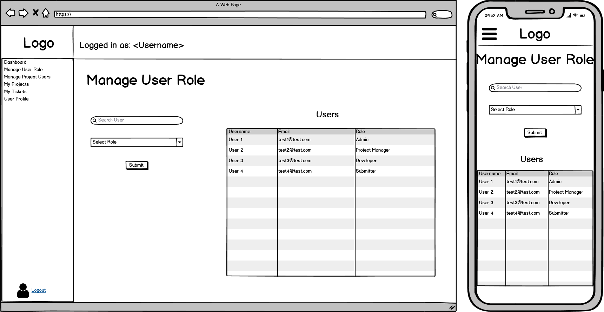

# Bug Tracker Application

## Harry Tran (T4A2-B)

Heroku deployed app can be found at bugtrackerapp.tk

GitHub repo can be found at https://github.com/HarryTranAU/bugtracker

## Installation

```
git clone https://github.com/HarryTranAU/bugtracker.git

cd bugtracker

python3 -m venv venv

source venv/bin/activate

pip install -r requirements.txt

```

setup .env with database URL

```

flask db init

flask db upgrade

```

To run gunicorn server

```

gunicorn --pythonpath src wsgi:app

```

## Purpose

An Issue/Bug Tracker organises user issues and feature requests into tickets that allow teams to delegate task effectively within a team environment. In addition to task delegation, Issue Trackers allow for task prioritization, helping teams work on what is most important first.

## Libraries

**Bcrypt** - is a password-hashing function. All passwords stored in the database are hashed using Bcrypt.

**Flask** - is a python web framework used to make web applications. The BugTracker backend was created using Flask.

**Flask-Login** - is an extension of Flask used to manage user sessions in a Flask application. Flask-Login is used for authentication and authorization within the BugTracker application.

**Flask-Migrate** - is an extension that handles SQLAlchemy database migrations for Flask applications using Alembic.

**Flask-SQLAlchemy** - is an extension for Flask that adds support for SQLAlchemy to the Flask application. Flask-SQLAlchemy is the ORM use to query the database in this BugTracker application.

**Flask-WTF, WTForms** - is an extension of Flask used for flexible forms validation and rendering library for Python web development.

**Gunicorn** - is a Python Web Server Gateway Interface HTTP server. Gunicorn takes care of everything which happens in-between the web server and the BugTracker application.

**Jinja2** - is a template engine written in Python. Used with HTML and Bootstrap to create the frontend of the BugTracker application.

**Psycopg2** - is a PostgreSQL database adapter for Python.

**python-dotenv** - reads the key-value pair from `.env` file and adds them to environment variable.

## Project Management

[Trello Board](https://trello.com/b/VQngDBQD/harrytrant4a2-a)


**Methodology**

The Trello-Kanban Method was chosen for this project because I personally work best with the big picture in front of me. The categories I've chosen for this project include:

- Rubric
- Needs to be done
- Currently Doing
- Needs Fixing/Review
- Done/Currently Works

I added `Rubric` for quick access to information about specific rubric items needed for this assessment. Mainly used to stay on track with the big picture and what needs to be focused on.

**Task Delegation**

Since this assessment was solo, task delegation was non-existent. However, to satisfy the requirement I will attempt to provide my thoughts and strategy for task delegation if this was to be a group assessment.

Task Delegation is this process of breaking a project into small chunks of tasks. This assessment can be broken down into the following sections:

- Database
- Backend
- Frontend
- Testing

In a 2-man team the assessment can be split into (backend, database) and frontend with both side having to make tests for their own code. Database does not need to be too complex for this assessment so it can be done along side with the backend.

If there was 3 or more people working on this assessment. There would be more people assigned to the backend working on different parts of the api. Example: One developer working on Projects endpoints, another on tickets endpoints.

**Difficulty Levels**

- Easy (Green) - Expect up to 1 hour
- Medium (Orange) - Expect between 1 to 4 hours
- Hard (Red) - Expect more than 4 hours. Assistance may be required.

Another addition to my Trello Strategy is colour-coding difficulty. Being able to forecast the duration of the task is a skill worth learning.Resource estimation (Time, cost, etc) is a skill project managers need so they can help plan a project accordingly to the clients requirements and within their budget.

## Deployment

Custom Domain: bugtrackerapp.tk

Using a free domain from Freenom.com. Also using CloudFlare DNS servers to redirect traffic from bugtrackerapp.tk to https://bugtracker-deploy.herokuapp.com/ where my application is deployed.


The BugTracker App was deployed on Heroku. The Workflow can be described as:

1. Git Push to GitHub
2. GitHub Actions executes CI workflow
3. Heroku set up to pull from master branch when changes are made


## Development Testing

[Development Testing (Google Sheets)](https://docs.google.com/spreadsheets/d/1yrvEObmn4wMj-ugmU7RTYfbhQh7Sd9l7irs5OdPHNo4/edit#gid=0)


## Production Testing

[Production Testing (Google Sheets)](https://docs.google.com/spreadsheets/d/1Bu48sDY6cYnlmB-jiO6baL3kbH3dTPq4rjI1al70iTw/edit#gid=0)


# **Part A - Documentation**

## **R1 General Information**

User need: A way to organise projects and issues/bugs for teams.

Proposed Application: Issue/Bug Tracker

**Purpose**

An Issue/Bug Tracker organises user issues and feature requests into tickets that allow teams to delegate task effectively within a team environment. In addition to task delegation, Issue Trackers allow for task prioritization, helping teams work on what is most important first.

**Functionality/Features**

Minimum Viable Product (MVP)

- Create Tickets from user submitted bugs and feature requests

Additional Functions/Features

- Assign Developers to Tickets
- Add task priority to Tickets
- Dashboard Overview of Tickets/Projects
- Assign Developers to specific Projects
- Assign/Change User Roles


**Target Audience**

- Software Development Teams
- Developers
- Project Managers
- Engineers
- Database Admins

**Tech Stack**

- Python
- Flask (SQLAlchemy, Marshmallow, Jinja, Migrate)
- Postgresql
- HTML
- CSS
- Javascript

## **R2 Dataflow Diagram**


Example Dataflow for a User to submit a Ticket. (Green numbers 1-5)

1. User logs into the app by providing username and password.
2. User proceeds to their personalized Dashboard using the details provided during login.
3. User clicks 'My Tickets' on the side menu to move to Tickets Overview.
4. User clicks 'Create New Ticket'.
5. User provides details for new Ticket.


## **R3 Application Architecture Diagram**


## **R4 User Stories**

The methodology used to highlight meaningful features of the project was to initially create User Stories related to 'What the user wants to do' while expanding to 'Who would use this feature' and 'What a potential feature would do'. From these User Stories, we can generate a Persona.

1. As a Database Admin, I should be able to assign roles quicker so that I can be more efficient with my time.


2. As a Project Manager, I want to delegate tickets to the right developer so that my team members can work best according to their strengths.


3. As a Developer, I want to see all my assigned tickets on one page so that I can prioritize major bugs first.


4. As a Ticket Submitter/End User, I should not have to click too many buttons to submit a ticket so that I can get on with my day.


## **R5 Wireframes**

### **Login Page**

The login page is where the user will start. Providing a username and password correctly will direct the user to the Dashboard page. Registering and new user and resetting a lost password is also possible on the login page.


### **Register User**

The register user page only has one function. To register a new user to the database. Provided the registration details are correct, the user will be redirected to the login page to log in with the newly registered credentials.


### **Forgot Password**

The forgot password page only has one function. To reset the password of a registered user in the database. The user only needs to provide an email to initiate the password reset function.


### **Dashboard**

The dashboard is where the user will land after correctly logging in. The dashboard will contain stats and figures for the user's specific projects and outstanding tickets. A sidebar will be provided for easy navigation to other pages of the application.


### **Manage User Role**

The Manage User Role page is used to change a user's role. Only an admin can change the role of another user. There are 4 planned roles for this application. Admin, Manager, Developer, Client. Admin will have the most privileges. Clients will have the least privileges.



### **Manage Project Users**

The Manage Project Users page will allow Admins and Managers to assign developers to projects.


### **My Projects**

The My Projects page will be an overview of all projects assigned to the currently logged in user.


### **Single Project**

The Single Project page will be an overview of all the tickets assigned to the current project.


### **My Tickets**

The My Tickets page will be an overview of all tickets assigned to the currently logged in users.


### **Single Ticket**

The Single Ticket page is a breakdown of the details in a single ticket.


### **New Ticket**

The New Ticket page will allow the currently logged in user to create a ticket assigning it to the selected project. 


### **User Profile**

The User Profile page shows details of the currently logged in user. The user can also change their password on the User Profile page.


## **R6 Trello**

[Trello Board Link](https://trello.com/b/VQngDBQD/harrytrant4a2-a)

Breakdown of the sections used:

- **Needs To Be Done:** The backlog of tasks to be completed
- **Currently Doing:** Today's scheduled tasks, currently working on
- **Needs Fixing/Review:** Either task's I'm stuck on, or it's done and needs to double-check before submitting
- **Done/Currently Works:** Completed work and checked that it fulfills the requirements.


Above: I place all the cards in 'review' before moving them to 'done' so I can check I have fulfilled all the requirements before submitting.

